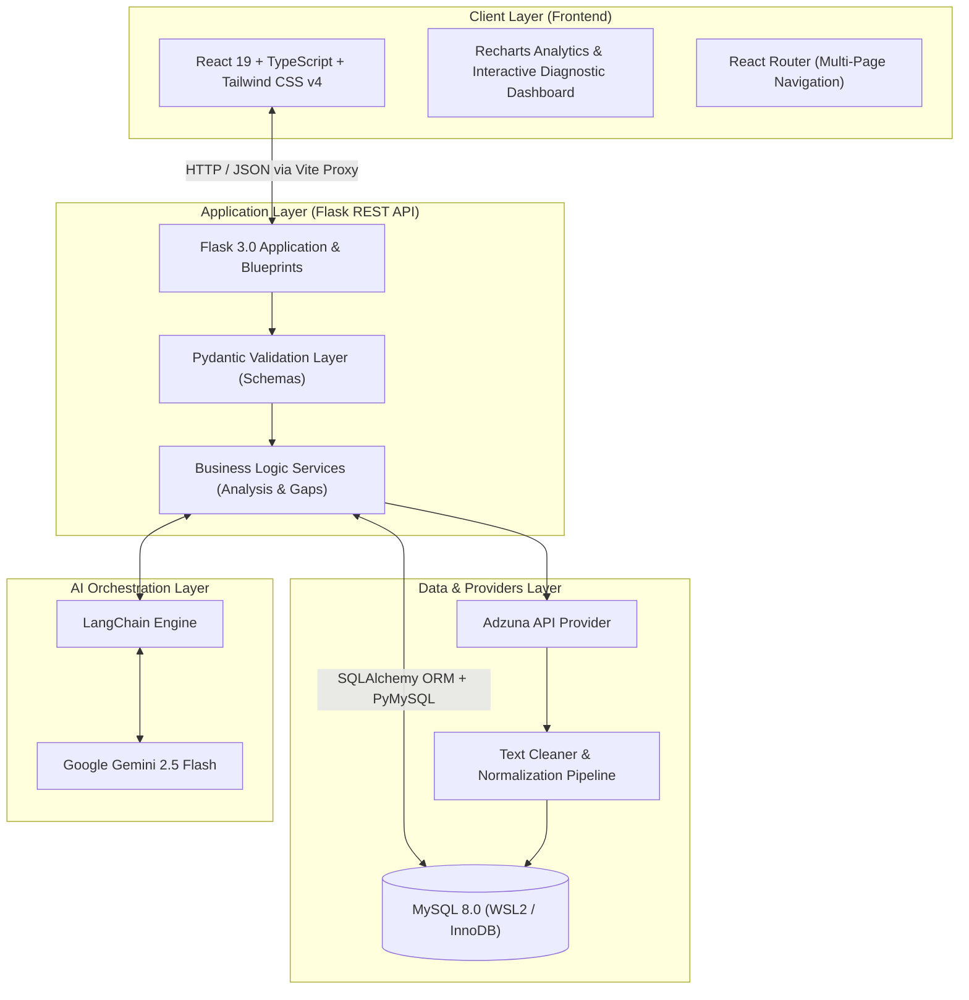

<div align="center">

# 🧭 CS Career Intelligence Platform

### *Evidence-Based Career Roadmaps Grounded in Real Job Market Data*

An AI-powered intelligence platform that analyzes live tech job postings, calculates empirical skill demand without LLM hallucinations, identifies individual skill gaps, and generates personalized career roadmaps for CS students and developers.

<br />

[](https://python.org)
[](https://flask.palletsprojects.com/)
[](https://react.dev/)
[](https://www.typescriptlang.org/)
[](https://tailwindcss.com/)
[](https://www.mysql.com/)
[](https://www.langchain.com/)
[](https://ai.google.dev/)

<br />

[Explore Features](#-key-features) •
[Architecture](#-system-architecture) •
[Quickstart](#-quickstart-guide) •
[API Docs](#-api-reference) •
[Database Schema](#-database-architecture) •
[Implementation Status](#-implementation-status)

</div>

---

## 💡 Overview

Generic career guides like "Top 10 Things to Learn as a Backend Developer" are often outdated, conflicting, and detached from what employers actually require. 

**CS Career Intelligence Platform** eliminates guesswork by turning current job postings into an empirical, data-driven learning engine:

1. **Extracts Live Market Requirements**: Analyzes 20–30 real job postings per role via verified APIs (Adzuna).
2. **Computes Deterministic Statistics**: Calculates actual market appearance percentages in Python/SQL — **the LLM never invents statistics**.
3. **Audits Your Existing Profile**: Evaluates your proficiency (0 = None to 4 = Expert) against employer demand.
4. **Synthesizes a Custom Roadmap**: Uses Google Gemini + LangChain to generate structured learning phases and portfolio projects tailored specifically to your unique skill gaps.

> [!IMPORTANT]
> **Core Engineering Guardrail**: Percentages, frequencies, and gap classifications are **100% deterministic** (calculated in Python & MySQL). The LLM is used exclusively for unstructured text parsing, taxonomy extraction, and synthesizing actionable learning guidance.

---

## 🏗️ System Architecture



---

## ✨ Key Features

| Category | Capability | Technical Implementation |
|:---|:---|:---|
| 🎯 **Career Taxonomy** | 25 canonical roles across 6 core tech domains with live search and category filtering | MySQL `career_roles` table, seed scripts, REST endpoints |
| 🔍 **Job Postings Ingestion** | Live retrieval from authorized job search APIs and manual import options | Pluggable `JobDataProvider` abstraction (Adzuna, Manual, Files) |
| 🧹 **Automated Text Cleaning** | Strips messy HTML boilerplate, collapses excess whitespace, and normalizes Unicode | Regex cleaner, Unicode NFKD normalization |
| 🤖 **AI Skill Extraction** | Parses technical and soft requirements with importance level and confidence scores | LangChain `with_structured_output` + Google Gemini |
| 🧬 **Skill Normalization** | Merges synonyms (e.g. `PostgreSQL`, `Postgres`, `psql` ➔ `PostgreSQL`) | Hash dictionary alias lookup + fallback normalizer |
| 📊 **Deterministic Analytics** | Pure SQL aggregation computing true market demand percentages | Parameterized analytical queries, Recharts bar charts |
| 🧑‍💻 **Developer Skill Profile** | Self-reported proficiency scoring (0 = None, 1 = Beginner, 2 = Mid, 3 = Adv, 4 = Expert) | `user_skills` table with fast lookup maps |
| ⚡ **Skill Gap Engine** | Identifies High, Medium, and Low priority gaps using configurable thresholds | Configurable rules in `config/settings.py` |
| 🗺️ **Personalized Roadmaps** | Step-by-step phase roadmap prioritizing critical missing requirements | Structured LangChain prompt with real calculated data |
| 🛠️ **Project Recommendations** | Recommends resume-ready portfolio projects targeting major gaps | Generative project recommender linked to roadmap items |

---

## 🎯 Supported Career Taxonomy

The platform features an extensible, database-driven career taxonomy of **25 roles across 6 domains**:

```
├── 💻 Software Development
│   ├── Software Engineer
│   ├── Backend Developer
│   ├── Frontend Developer
│   ├── Full Stack Developer
│   └── Mobile Developer (iOS / Android)
├── 🤖 AI / Machine Learning
│   ├── AI Engineer
│   ├── ML Engineer
│   ├── LLM Engineer
│   ├── Generative AI Engineer
│   └── MLOps Engineer
├── 📊 Data Engineering & Analytics
│   ├── Data Scientist
│   ├── Data Analyst
│   ├── Data Engineer
│   └── Analytics Engineer (dbt)
├── ☁️ Cloud & Infrastructure
│   ├── DevOps Engineer
│   ├── Cloud Engineer (AWS / GCP / Azure)
│   ├── Site Reliability Engineer (SRE)
│   ├── Platform Engineer
│   └── GPU / CUDA Engineer
├── 🛡️ Cybersecurity
│   ├── Cybersecurity Engineer
│   ├── Application Security Engineer
│   └── SOC Analyst
└── 🧪 Quality & Reliability
    ├── QA Engineer
    ├── SDET (Software Dev Engineer in Test)
    └── Automation Test Engineer
```

---

## 🧰 Technology Stack

### Backend
* **Runtime & Framework**: Python 3.10+, Flask 3.0+
* **ORM & Database Drivers**: SQLAlchemy 2.0, PyMySQL, Cryptography
* **Schema Migration & Versioning**: Flask-Migrate, Alembic
* **Data Validation**: Pydantic v2 (Strict typing & validation)
* **Cross-Origin Handling**: Flask-CORS
* **Testing**: PyTest with automated test clients

### Frontend
* **Core & Build System**: React 19, TypeScript, Vite 8
* **Styling**: Tailwind CSS v4, Lucide React (Modern iconography)
* **Routing**: React Router DOM v7
* **Data Visualization**: Recharts (Responsive bar charts & analytics)
* **Networking**: Axios with centralized error interceptors
* **Code Quality**: Oxlint (High-performance linter)

### AI & Data
* **LLM Engine**: Google Gemini 2.5 Flash via `langchain-google-genai`
* **Primary Database**: MySQL 8.0 Community Server (WSL2 / Local)
* **Job Ingestion API**: Adzuna Developer API

---

## 📁 Repository Structure

```text
Career_Intelligence/
├── backend/
│   ├── ai/               # Gemini LLM prompts, extractor, roadmap & project generators
│   │   ├── llm.py                  # LangChain ChatGoogleGenerativeAI factory
│   │   ├── prompts.py              # Centralized system prompts
│   │   ├── skill_extractor.py      # Structured skill extraction
│   │   ├── roadmap_generator.py    # Personalized roadmap synthesis
│   │   └── project_recommender.py  # Portfolio project recommendations
│   ├── config/           # Application configurations and gap thresholds
│   │   ├── __init__.py             # Config class & env variable loader
│   │   └── settings.py             # GAP_THRESHOLDS & domain constants
│   ├── migrations/       # Version-controlled Alembic migrations
│   ├── models/           # SQLAlchemy ORM models
│   │   ├── career.py, job.py, skill.py, analysis.py, user.py, roadmap.py
│   ├── providers/        # Pluggable job search providers
│   │   ├── base.py                 # Abstract JobDataProvider interface
│   │   ├── adzuna.py               # Live Adzuna API provider
│   │   ├── jooble.py, manual.py, file_provider.py
│   ├── routes/           # Modular Flask Blueprints
│   │   ├── health.py, careers.py, jobs.py, skills.py, analysis.py, roadmap.py, profile.py, projects.py
│   ├── schemas/          # Pydantic serialization & validation schemas
│   ├── services/         # Business logic layer (Deterministic calculations)
│   ├── tests/            # PyTest unit & integration tests
│   ├── utils/            # Text cleaner and skill name normalizer
│   ├── app.py            # Flask application factory
│   └── requirements.txt  # Pinned Python dependencies
├── frontend/
│   ├── src/
│   │   ├── components/   # Navbar, Footer, HealthCard, SystemOverview, MarketPreviewChart
│   │   ├── hooks/        # useHealth, useCareers, custom reactive hooks
│   │   ├── pages/        # HealthDashboard, CareerSelection, JobSearch, Analysis, Roadmap
│   │   ├── services/     # Axios API service instances
│   │   ├── types/        # TypeScript interfaces (Career, Job, Skill, Analysis, Roadmap)
│   │   ├── App.tsx       # Root React Router setup
│   │   └── main.tsx      # DOM mount point
│   ├── package.json
│   └── vite.config.ts    # Vite configuration with /api proxy to Flask (5000)
├── database/
│   ├── schema/           # schema.sql (Reference DDL statements)
│   ├── seeds/            # career_roles.sql, skills_aliases.sql
│   └── queries/          # market_analysis.sql (Analytical reference queries)
├── scripts/              # Standalone verification & seed scripts
│   ├── seed_database.py  # Automated MySQL seeder
│   ├── test_mysql.py     # MySQL connectivity probe
│   ├── test_job_api.py   # Adzuna API verification
│   └── test_llm.py       # Gemini API verification
├── .env.example          # Environment variable template
└── README.md
```

---

## 🗄️ Database Architecture

The authoritative schema is maintained via **Alembic migrations** (`backend/migrations/`) while raw SQL references reside in `database/`:

```
┌────────────────┐       ┌─────────────────┐       ┌─────────────────┐
│  career_roles  │◄──────┤      jobs       │◄──────┤   job_skills    │
└───────┬────────┘       └────────┬────────┘       └────────┬────────┘
        │                         │                         │
        ▼                         ▼                         ▼
┌────────────────┐       ┌─────────────────┐       ┌─────────────────┐
│    analyses    │       │     skills      │◄──────┤   user_skills   │
└───────┬────────┘       └────────┬────────┘       └────────▲────────┘
        │                         │                         │
        ▼                         ▼                         │
┌────────────────┐       ┌─────────────────┐       ┌────────┴────────┐
│    roadmaps    │◄──────┤ roadmap_phases  │       │      users      │
└───────┬────────┘       └────────┬────────┘       └─────────────────┘
        ▼                         ▼
┌────────────────┐       ┌─────────────────┐
│ roadmap_items  │◄──────┤roadmap_projects │
└────────────────┘       └─────────────────┘
```

<details>
<summary><strong>View Detailed Tables Overview</strong></summary>

| Table | Description |
|:---|:---|
| `career_roles` | Canonical list of 25 supported tech careers across 6 categories |
| `jobs` | Ingested job postings with cleaned descriptions and external IDs |
| `skills` | Canonical dictionary of normalized tech skills and categories |
| `job_skills` | Many-to-many relationship linking jobs to skills (importance, confidence) |
| `user_skills` | User self-reported skill proficiency ratings (0 to 4) |
| `analyses` | Market analysis runs for a career, target location, and experience level |
| `roadmaps` | Generated learning roadmaps tied to users and careers |
| `roadmap_phases` | Logical phases within a roadmap (e.g. Phase 1: Core Fundamentals) |
| `roadmap_items` | Specific skills or concepts to learn within each phase |
| `projects` | Portfolio project ideas mapped to skill gaps |
| `roadmap_projects`| Junction table associating projects with roadmap phases |

</details>

---

## 📡 API Reference

All endpoints return JSON and use standard HTTP response codes.

| Method | Endpoint | Description |
|:---:|:---|:---|
| `GET` | `/api/health` | System health check (service name, version, status) |
| `GET` | `/api/careers` | List career roles (supports `?category=` and `?search=`) |
| `GET` | `/api/careers/categories` | List distinct career categories |
| `GET` | `/api/careers/<id>` | Retrieve specific career role details |
| `GET` | `/api/jobs` | Query stored jobs (supports `?career_role_id=` and `?limit=`) |
| `POST` | `/api/jobs/import` | Manually import a job description for analysis |
| `GET` | `/api/jobs/<id>` | Retrieve single job posting details |
| `GET` | `/api/skills` | List canonical normalized skills |
| `GET` | `/api/skills/top` | Top skills ranked by empirical market frequency (`?career_role_id=`) |
| `GET` | `/api/analysis/<id>` | Retrieve analysis metadata |
| `GET` | `/api/analysis/<id>/skills` | Get calculated market skill breakdown |
| `GET` | `/api/analysis/<id>/gaps` | Compute deterministic skill gaps (`?user_id=`) |
| `GET` | `/api/profile` | Retrieve user profile (defaults to user ID 1) |
| `GET` | `/api/profile/skills` | List user's rated skills |
| `GET` | `/api/projects` | List recommended portfolio projects |

---

## 🚀 Quickstart Guide

### Prerequisites
* **Python**: 3.10 or higher
* **Node.js**: v18 or higher (npm / pnpm)
* **MySQL**: 8.0+ (running locally or inside WSL2)

### 1. Clone & Configure Environment
```bash
git clone https://github.com/ahamudul-hasan/Career_Intelligence.git
cd Career_Intelligence

# Copy environment template
cp .env.example .env
```

Ensure `.env` contains your MySQL credentials and Google Gemini API key:
```env
MYSQL_HOST=127.0.0.1
MYSQL_PORT=3306
MYSQL_USER=career_user
MYSQL_PASSWORD=career_password
MYSQL_DATABASE=career_intelligence

GEMINI_API_KEY=your_gemini_api_key_here
GEMINI_MODEL=gemini-2.5-flash

ADZUNA_APP_ID=your_adzuna_app_id
ADZUNA_APP_KEY=your_adzuna_app_key
```

### 2. Backend Setup & Database Seeding
```bash
# Set up Python virtual environment
python -m venv backend/venv

# Activate virtual environment
# Windows:
backend\venv\Scripts\activate
# Linux/macOS:
source backend/venv/bin/activate

# Install requirements
pip install -r backend/requirements.txt

# Run database seed script (Seeds 25 career roles and canonical skills)
python scripts/seed_database.py

# Run test suite to verify everything passes
pytest backend/tests

# Start Flask API server (runs on http://127.0.0.1:5000)
python -m backend.app
```

### 3. Frontend Setup
In a new terminal window:
```bash
cd frontend

# Install frontend dependencies
npm install

# Start Vite dev server (runs on http://127.0.0.1:5173)
npm run dev
```

Open **http://127.0.0.1:5173** in your browser.

---

## 📈 Implementation Status

| Phase | Milestone | Status | Description |
|:---:|:---|:---:|:---|
| **0** | **Environment & Connectivity** | ✅ Complete | Verified Adzuna, Google Gemini, and MySQL connectivity |
| **1** | **Project Skeleton** | ✅ Complete | Flask blueprints, Pydantic schemas, React Router, Vite proxy, health round-trip |
| **2** | **Career Taxonomy** | ✅ Complete | Seeded 25 roles across 6 categories, career selection UI with instant search |
| **3** | **Job Model & Manual Import** | ⏳ In Queue | Job storage model, manual description paste, job CRUD endpoints |
| **4** | **Provider Integration** | ⏳ In Queue | Live Adzuna API search, deduplication pipeline, automated ingestion |
| **5** | **Text Cleaning Pipeline** | ⏳ In Queue | HTML stripping, whitespace normalization, Unicode sanitization |
| **6** | **LangChain Skill Extraction** | ⏳ In Queue | Structured Gemini extraction for categories, importance, and confidence |
| **7** | **Skill Normalization** | ⏳ In Queue | Canonical alias mapping and duplicate collapse |
| **8** | **Deterministic Market Analysis**| ⏳ In Queue | Pure Python/SQL frequency aggregations, Recharts dashboard |
| **9** | **User Skill Profile** | ⏳ In Queue | Self-assessment proficiency tracking (0–4) |
| **10** | **Skill Gap Engine** | ⏳ In Queue | High / Medium / Low priority gap evaluation |
| **11** | **Personalized Roadmap** | ⏳ In Queue | Structured Gemini learning sequence grounded in calculated gaps |
| **12** | **Project Recommendations** | ⏳ In Queue | Concrete portfolio projects linked to skill gap closure |

---

## 🛡️ License

Distributed under the **MIT License**. See `LICENSE` for more information.

<div align="center">
Built with ❤️ for Computer Science students and aspiring engineers.
</div>
